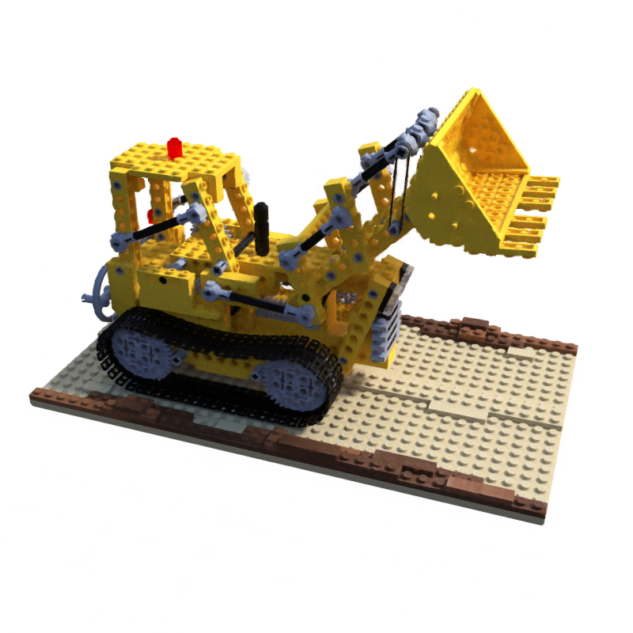

# Get Start
1. Run train `python train-nerf.py --half-resolution`

# Run Demo
1. Run `python train-nerf.py --make-video360`
    - Produce a video with 360 degree rendering

# Demo

# Reference
1. https://github.com/bmild/nerf
2. https://github.com/yenchenlin/nerf-pytorch
3. 免费配套讲解视频【认识nerf、了解nerf网络结构搭建】：https://www.bilibili.com/video/BV1xL411y7Qa
4. 配套讲解视频【完整付费】可以加 wechat：shouxie_ai，发口令：github_nerf来了解。
